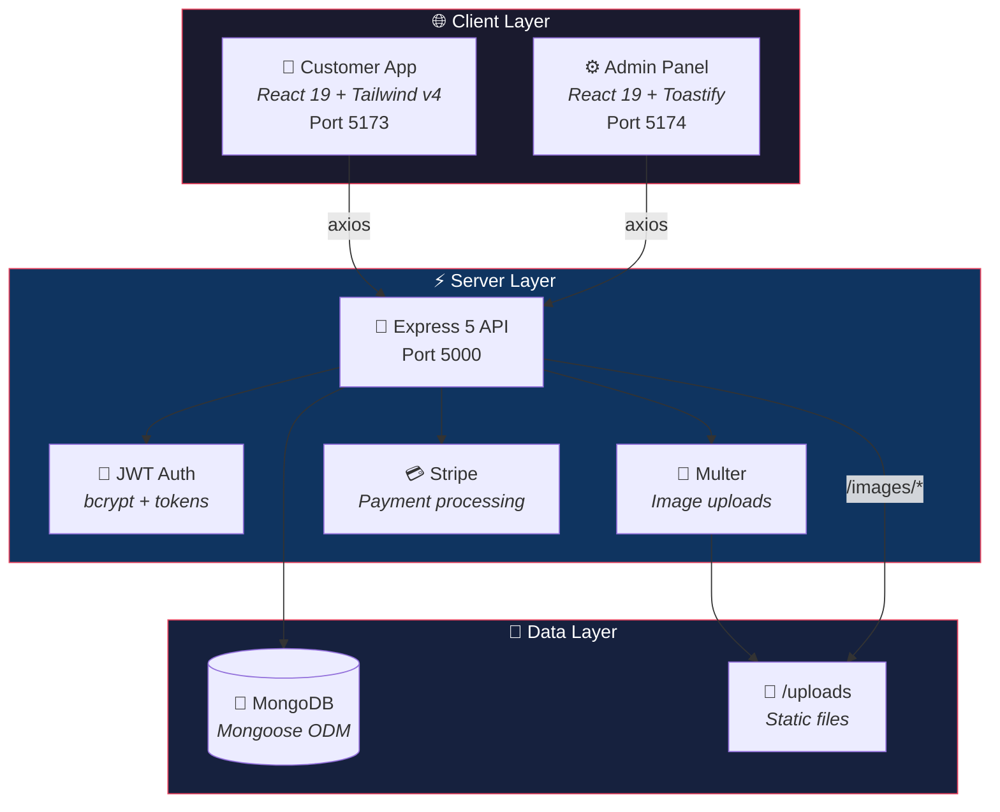

<div align="center">


# 🍔 Zwiggy

### *Food Delivery, Reimagined.*

A full-stack MERN food delivery platform with real-time order management, Stripe payments, and a dedicated admin dashboard.

[](https://react.dev/)
[](https://nodejs.org/)
[](https://www.mongodb.com/)
[](https://stripe.com/)
[](https://tailwindcss.com/)
[](https://vitejs.dev/)

<br/>

[Features](#-features) · [Tech Stack](#-tech-stack) · [Quick Start](#-quick-start) · [API Reference](#-api-reference) · [Architecture](#-architecture) · [License](#-license)

---

</div>

<br/>

## ✨ Features

<table>
<tr>
<td width="50%">

### 🛒 Customer App

- 🍕 **Browse by Category** — Explore menus filtered by food type
- ➕ **Cart Management** — Add, remove, and update quantities
- 🔐 **Auth System** — Secure signup & login with JWT
- 📦 **Order Placement** — Full checkout with delivery details
- 💳 **Stripe Integration** — Secure online payments

</td>
<td width="50%">

### ⚙️ Admin Dashboard

- 📸 **Add Food Items** — Upload images, set prices & categories
- 📋 **Manage Listings** — View, edit, and remove menu items
- 📊 **Order Tracking** — Monitor all orders and update status
- 🔔 **Toast Notifications** — Real-time feedback on actions

</td>
</tr>
</table>

<br/>

## 🛠 Tech Stack

<div align="center">

### Frontend


### Backend


### Payments & Uploads


</div>

<br/>

## 🏗 Architecture



<br/>

## 📁 Project Structure

```
zwiggy/
│
├── 🛒 frontend/                 # Customer-facing application
│   └── src/
│       ├── components/          # Navbar, Header, ExploreMenu, FoodDisplay,
│       │                        # FoodItem, LoginPopup, Footer, AppDownload
│       ├── pages/               # Home, Cart, PlaceOrder
│       └── context/             # Global state (cart, auth, API URL)
│
├── ⚙️ admin/                    # Admin dashboard
│   └── src/
│       ├── components/          # Sidebar, Navbar
│       └── pages/               # Add Items, List Items, Orders
│
├── 📡 backend/                  # REST API server
│   ├── config/                  # MongoDB connection setup
│   ├── controllers/             # foodController, userController
│   ├── models/                  # foodModel, userModel (Mongoose schemas)
│   ├── routes/                  # /api/food, /api/user
│   └── server.js                # Entry point
│
└── 📄 README.md
```

<br/>

## 🚀 Quick Start

### Prerequisites

| Tool | Version | Required For |
|------|---------|-------------|
| [Node.js](https://nodejs.org/) | v18+ | Runtime |
| [MongoDB](https://www.mongodb.com/) | Latest | Database (local or [Atlas](https://www.mongodb.com/atlas)) |
| [Stripe Account](https://dashboard.stripe.com/register) | — | Payment processing |

### 1️⃣ Clone

```bash
git clone https://github.com/jmanish45/zwiggy.git
cd zwiggy
```

### 2️⃣ Backend Setup

```bash
cd backend
npm install
```

Create `backend/.env`:

```env
MONGO_URI=your_mongodb_connection_string
JWT_SECRET=your_jwt_secret
STRIPE_SECRET_KEY=your_stripe_secret_key
```

```bash
npm run server        # → http://localhost:5000
```

### 3️⃣ Frontend Setup

```bash
cd frontend
npm install
npm run dev           # → http://localhost:5173
```

### 4️⃣ Admin Panel Setup

```bash
cd admin
npm install
npm run dev           # → http://localhost:5174
```

<br/>

## 📡 API Reference

<details>
<summary><b>🍔 Food Endpoints</b></summary>

| Method | Endpoint | Description | Auth |
|--------|----------|-------------|------|
| `GET` | `/api/food/list` | Fetch all food items | No |
| `POST` | `/api/food/add` | Add food item (multipart) | Admin |
| `POST` | `/api/food/remove` | Remove a food item | Admin |
| `GET` | `/images/:filename` | Serve uploaded image | No |

</details>

<details>
<summary><b>👤 User Endpoints</b></summary>

| Method | Endpoint | Description | Auth |
|--------|----------|-------------|------|
| `POST` | `/api/user/register` | Create new account | No |
| `POST` | `/api/user/login` | Login → JWT token | No |

</details>

<br/>

## 🤝 Contributing

Contributions are welcome! Feel free to open issues and submit pull requests.

1. Fork the repository
2. Create your feature branch (`git checkout -b feature/amazing-feature`)
3. Commit your changes (`git commit -m 'Add amazing feature'`)
4. Push to the branch (`git push origin feature/amazing-feature`)
5. Open a Pull Request

<br/>

## 📜 License

This project is open source and available under the [MIT License](LICENSE).

---

<div align="center">

**Built with ❤️ using the MERN Stack**

<sub>If you found this useful, consider giving it a ⭐</sub>

</div>
